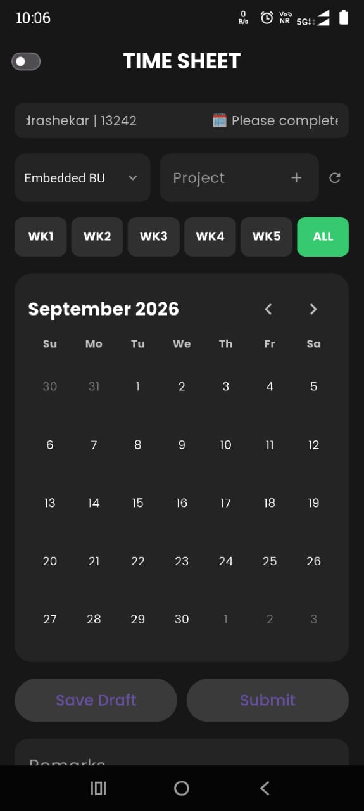
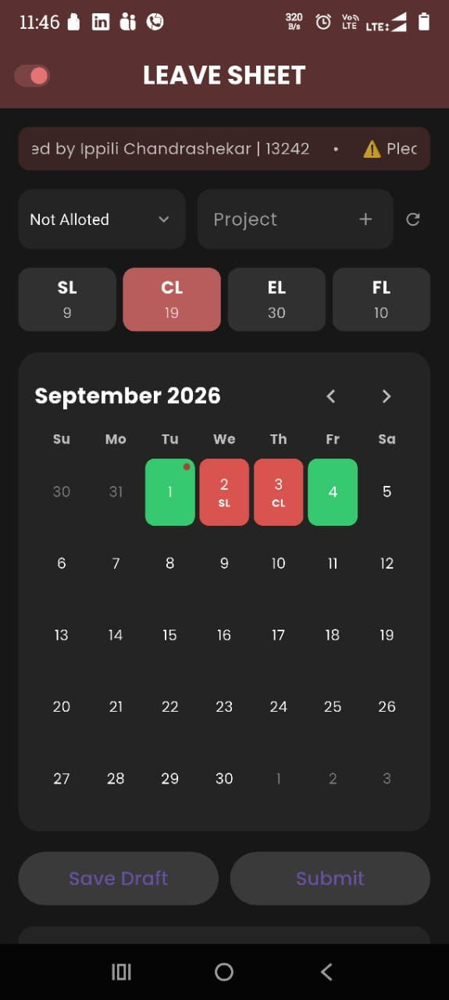
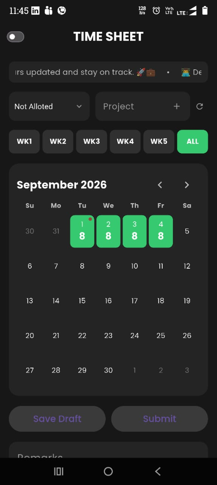
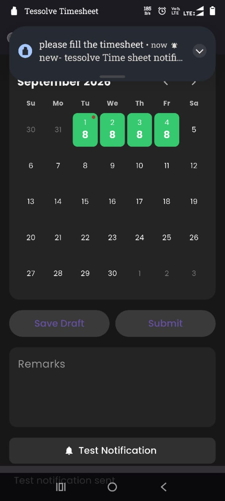

# appie

Appie is TESSOLVE's organizational timesheet and leave-management app. It brings time entry, leave balances, holiday calendars, announcements, and reminders together, helping employees submit updates and stay aware of important tasks.

## Getting Started

This project is a starting point for a Flutter application.

A few resources to get you started if this is your first Flutter project:

- [Learn Flutter](https://docs.flutter.dev/get-started/learn-flutter)
- [Write your first Flutter app](https://docs.flutter.dev/get-started/codelab)
- [Flutter learning resources](https://docs.flutter.dev/reference/learning-resources)

For help getting started with Flutter development, view the
[online documentation](https://docs.flutter.dev/), which offers tutorials,
samples, guidance on mobile development, and a full API reference.

## App Screenshots

### Landing Page
The main screen brings timesheets, leave information, and alerts together for quick access.

### Leave Tracking
Review leave categories, available balances, and calendar entries in one place.

### Special Task Notification
The red calendar marker highlights a date with a special task that needs attention.

### Notification
Device notifications provide timely reminders, such as a prompt to complete a timesheet.
